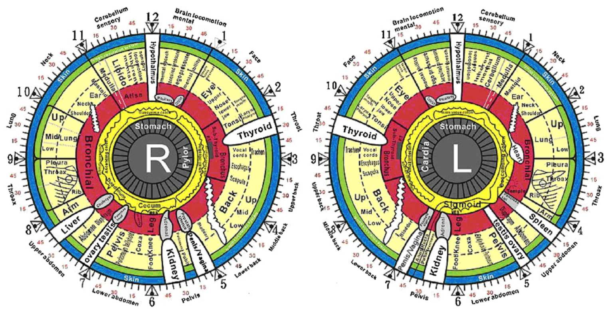

# Iridologia sob Lentes Científicas: Avaliação Crítica com Aprendizado de Máquina

Projeto de análise de iridologia para detecção de Diabetes Mellitus Tipo 2 (DM2) utilizando técnicas de aprendizado de máquina, com ênfase em rigor metodológico e controle de vieses.

> **Referência:** Baseado na metodologia descrita no artigo "Iridologia sob Lentes Científicas: Avaliação Crítica com Aprendizado de Máquina" - UFABC, Programa de Iniciação Científica.



## 📋 Visão Geral

Este projeto implementa um pipeline completo e auditável para:
- Classificação binária (DM2 vs. Controle) a partir de imagens de íris
- Validação cruzada estratificada com separação por pessoa (controle de data leakage)
- Testes de robustez com transformações fotométricas
- Análises locais por região (setores angulares e região pancreática)

## 🏗️ Estrutura do Projeto

```
diabetes-iridology-master/
├── main.py                 # Pipeline principal (ponto de entrada)
├── requirements.txt        # Dependências Python 3.8+
├── README.md               # Este arquivo
├── src/                    # Módulos do projeto
│   ├── __init__.py         # Inicialização do pacote
│   ├── config.py           # Configurações centralizadas
│   ├── segmentation.py     # Segmentação de íris/pupila (active contours)
│   ├── normalization.py    # Normalização rubber sheet (Daugman)
│   ├── preprocessing.py    # Transformações fotométricas
│   ├── feature_extraction.py # Extração de features
│   ├── classifiers.py      # Classificadores ML
│   ├── metrics.py          # Métricas de avaliação
│   ├── local_analysis.py   # Análise por regiões
│   └── results_generator.py # Geração de relatórios
├── Data/
│   └── Data/
│       ├── all/            # Todos os dados
│       ├── L_split/        # Apenas olhos esquerdos
│       ├── R_split/        # Apenas olhos direitos
│       ├── personBase/     # Separação por pessoa
│       └── personBase_invert/
├── legacy/                 # Código original (referência)
│   ├── Main.py
│   ├── Classifying.py
│   ├── featureExtraction.py
│   └── pre processing/
└── img/                    # Imagens e figuras
```

## 🚀 Instalação

1. Clone o repositório ou extraia os arquivos

2. Crie um ambiente virtual Python 3.8+:
```bash
python -m venv venv
venv\Scripts\activate  # Windows
# ou
source venv/bin/activate  # Linux/Mac
```

3. Instale as dependências:
```bash
pip install -r requirements.txt
```

4. Baixe e extraia os dados em `Data/Data/`

## 💻 Uso

### Pipeline Completo do Artigo

O código implementa todas as etapas descritas na metodologia do artigo:

1. **Segmentação de íris e pupila** (active contours)
2. **Normalização geométrica** (rubber sheet model de Daugman)
3. **Pré-processamento fotométrico** (CLAHE, histograma, blur)
4. **Extração de features** (pixel, LBP, GLCM/Haralick)
5. **Classificação** (LR, SVM, RF, MLP, AdaBoost)
6. **Validação cruzada estratificada** (K=5 folds)
7. **Análise local por região** (setores 10°, malha pancreática 12×12)

### Análise com Dados Pré-processados (Pickle)

```bash
# Análise em todos os datasets
python main.py --run-all

# Dataset específico
python main.py --dataset personBase --channel gray

# Teste de robustez fotométrica
python main.py --robustness-test --dataset personBase

# Análise local por região
python main.py --local-analysis --eye-side left --dataset personBase
```

### Processamento de Imagens Raw (Novas Imagens)

```bash
# Segmentar e normalizar uma única imagem (visualização)
python main.py --segment-single --image-path ./minha_imagem.jpg

# Processar lote de imagens raw
# Estrutura esperada: raw_images/control/ e raw_images/diabetic/
python main.py --process-raw --raw-path ./raw_images --output-processed ./processed

# Pipeline completo: raw -> segmentação -> normalização -> classificação
python main.py --full-pipeline --raw-path ./raw_images
```

## 📊 Metodologia

### Pipeline do Artigo (Implementação Completa)

```
┌─────────────────────────────────────────────────────────────────┐
│                    IMAGENS RAW DO OLHO                         │
└─────────────────────────────────────────────────────────────────┘
                              │
                              ▼
┌─────────────────────────────────────────────────────────────────┐
│ SEGMENTAÇÃO (src/segmentation.py)                               │
│ • Detecção de pupila (limiarização + active contours)          │
│ • Detecção de íris (active contours expansivos)                │
│ • Refinamento com canais HSV                                    │
└─────────────────────────────────────────────────────────────────┘
                              │
                              ▼
┌─────────────────────────────────────────────────────────────────┐
│ NORMALIZAÇÃO RUBBER SHEET (src/normalization.py)               │
│ • Modelo de Daugman: mapeamento polar → retangular             │
│ • Saída: 201×720 pixels (radial × angular)                     │
│ • Permite comparação ponto-a-ponto                              │
└─────────────────────────────────────────────────────────────────┘
                              │
                              ▼
┌─────────────────────────────────────────────────────────────────┐
│ PRÉ-PROCESSAMENTO FOTOMÉTRICO (src/preprocessing.py)           │
│ • Original | Histogram EQ | CLAHE | Gaussian Blur              │
└─────────────────────────────────────────────────────────────────┘
                              │
                              ▼
┌─────────────────────────────────────────────────────────────────┐
│ EXTRAÇÃO DE FEATURES (src/feature_extraction.py)               │
│ • Pixel features (baseline)                                     │
│ • LBP (Local Binary Patterns)                                   │
│ • GLCM / Haralick (textura)                                     │
│ • Estatísticas de intensidade                                   │
│ • Gabor / HOG                                                   │
└─────────────────────────────────────────────────────────────────┘
                              │
                              ▼
┌─────────────────────────────────────────────────────────────────┐
│ CLASSIFICAÇÃO (src/classifiers.py)                             │
│ • LR, SVM, RF, MLP, AdaBoost                                   │
│ • Validação cruzada estratificada (K=5)                        │
│ • Separação por pessoa (controle de data leakage)              │
└─────────────────────────────────────────────────────────────────┘
                              │
                              ▼
┌─────────────────────────────────────────────────────────────────┐
│ AVALIAÇÃO (src/metrics.py)                                     │
│ • Accuracy, Sensitivity, Specificity, Precision, F1           │
│ • Matriz de confusão                                            │
│ • Desvio padrão por fold                                        │
└─────────────────────────────────────────────────────────────────┘
```

### Esquemas de Particionamento
| Dataset | Descrição |
|---------|-----------|
| `all` | Todos os dados sem separação |
| `L_split` | Apenas olhos esquerdos |
| `R_split` | Apenas olhos direitos |
| `personBase` | **Separação por pessoa** (controle principal) |
| `personBase_invert` | Separação invertida |

### Classificadores
- **LR**: Regressão Logística
- **SVM**: Support Vector Machine
- **RF**: Random Forest
- **MLP**: Multi-Layer Perceptron
- **AdaBoost**: Adaptive Boosting

### Métricas
- Accuracy (acurácia global)
- Sensitivity (sensibilidade/recall)
- Specificity (especificidade)
- Precision (precisão)
- F1-score

### Transformações Fotométricas
- Original (sem transformação)
- Histogram Equalization
- CLAHE (Contrast Limited Adaptive Histogram Equalization)
- Gaussian Blur

## 📈 Resultados Esperados

Conforme metodologia do artigo, o dataset `personBase` tende a apresentar os melhores resultados por reduzir vazamento de identidade:

| Dataset | Melhor Classificador | Acurácia |
|---------|---------------------|----------|
| personBase | MLP | ~92.36% |
| personBase | LR | ~90.81% |
| personBase | SVM | ~88.24% |

## 📁 Dataset

- **88 casos diabéticos** e **108 casos controle**
- Imagens coletadas sob supervisão de oftalmologistas do Hospital Farabi
- Download: [Google Drive](https://drive.google.com/file/d/1y7W84iMXkXcL7pnS-wkN2I5V5VIvZrci/view?usp=sharing)

## 📚 Citação

```bibtex
@inproceedings{iridology-icbme2018,
  author    = {Parsa Moradi and Naghme Nazer and Amirhosein Khasahmadi 
               and Hoda Mohammadzadeh and Hasan Khojasteh Jafari},
  title     = {Discovering Informative Regions in Iris Images to Predict Diabetes},
  booktitle = {25th National and 3rd International Iranian Conference 
               on Biomedical Engineering (ICBME)},
  year      = {2018},
}
```

## 📬 Contato

Para questões sobre o código ou metodologia:
- [Naghme Nazer](mailto:naghme93@gmail.com)
- [Parsa Moradi](mailto:parsa.moradi73@gmail.com)
